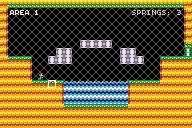

# Top Hop - A Tiny Challenge (LIKO-12 Version)

This port is very similar to the original TIC-80 game.

- The sound is similar.
- The resolution of LIKO-12 is 192x128 instead of 240x136
- The color palette was changed
- Levelcount reduced from 8 to 6 (based on the TIC-80, modi1fied to fit LIKO-12's map size)
- LIKO-12 cursor is enabled to make gameplay easier

## Screenshot comparsion

|              | TIC-80 | LIKO-12 |
|--------------|:-------:|:-------:|
| Title Screen |  |  |
| Gameplay     |  |  |
| Ending       |  |  |

## About LIKO-12

Quote from the [LIKO-12 GitHub Repository](https://github.com/LIKO-12/LIKO-12):

```
LIKO-12 is a fantasy computer that you can use to make, play and share tiny retro-looking games and programs. It comes with a default, fully customizable, DOS-like operating system installed, called DiskOS.

DiskOS provides an environment with basic command line programs and visual game editors.

The created games and programs are saved as disk files that can be easily shared to friends or anyone else.
```

For more informations, visit their official website https://liko-12.github.io/
