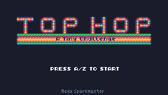
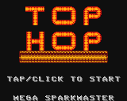
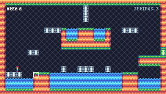
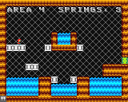
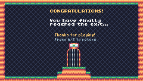
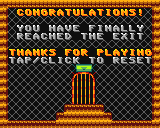

# Top Hop - A Tiny Challenge (LowRes NX Version)

This port is very different from the other versions.

- The resolution of LowRes NX is 160x128 instead of 240x136
- Reduced color palette from 16 to 4
- 6 Levels based on the PQ93 version
- Only mouse/touch due to how LowRes NX works

## Screenshot comparsion

|              | TIC-80 | LowRes NX |
|--------------|:-------:|:-------:|
| Title Screen |  |  |
| Gameplay     |  |  |
| Ending       |  |  |

## About LowRes NX

Quote from the [official homepage](https://lowresnx.inutilis.com/):

```
Make your own retro games on a virtual game console. Program in the classic BASIC language and create sprites, tile maps, sound and music with the included tools. As a beginner you will quickly understand how to create simple text games or show your first sprite on a tile map. As an experienced programmer you can discover the full potential of retro hardware tricks!
```

For more informations, visit their official website https://lowresnx.inutilis.com/

## Noteworthy Notes

Since LowRes NX uses a dialect of BASIC instead of Lua, this version had to be written from scratch.