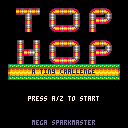
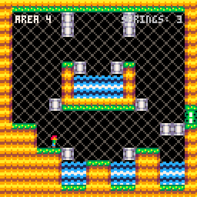
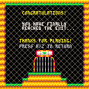

# Top Hop - A Tiny Challenge (PICO-8 Version)

- The resolution of PICO-8 is 128x128 instead of 240x136
- The color palette was changed
- 6 Levels based on the PQ93 version

## Screenshot comparsion

|              | TIC-80 | PICO-8 |
|--------------|:-------:|:-------:|
| Title Screen |  |  |
| Gameplay     |  |  |
| Ending       |  |  |

## About PICO-8

PICO-8 is developed by [Lexaloffice Games](https://www.lexaloffle.com/) and can be purchased on the [PICO-8 product page](https://www.lexaloffle.com/pico-8.php).
