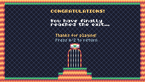

# Top Hop - A Tiny Challenge (PQ93 Version)

- The sound is similar.
- The resolution of PQ93 is 160x144 instead of 240x136
- The color palette was changed
- 8 Levels based on TIC-80

## Screenshot comparsion

|              | TIC-80 | PQ93 |
|--------------|:-------:|:-------:|
| Title Screen |  |  |
| Gameplay     |  |  |
| Ending       |  |  |

## About PQ93

Quote from the official website: https://pennie.itch.io/pq93

```
PQ93 is a fantasy console written in modern C++ (previously in C). it uses Gameboy resolution (160x144), the arne16 color palette, and MoonScript. It runs on Windows, macOS, and Ubuntu.
```

## Noteworthy Notes

The PQ93 port was coded from scratch with moonscript (the coding language that PQ93 uses), having in mind the optimizations derived from the Pixel Vision 8 version. Like that version, this one also draws the cursor on screen as a sprite. 
