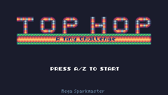
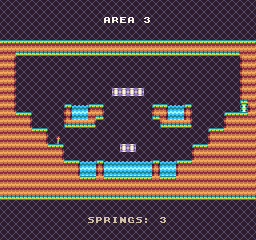

# Top Hop - A Tiny Challenge (Pixel Vision 8 Version)


- 256x240 resolution instead of the original 240x136
- 8 Level based on the TIC-80 version

## Screenshot comparsion

|              | TIC-80 | Pixel Vision 8 |
|--------------|:-------:|:-------:|
| Title Screen |  |  |
| Gameplay     |  |  |
| Ending       |  |  |

## About Pixel Vision 8

Quote from the official website https://pixelvision8.github.io/PixelVision8Website/

```
Pixel Vision 8 is a next generation 8-bit fantasy game console. Don't just make games, design your system's specs to match actual hardware, or create something new.
```

## Noteworthy Notes

The code of this version was considerably optimized by the developer of Pixel Vision 8, and it served as the basis for the improved code of the newest LIKO-12 version update and some bugfixes from the previous versions. The latest updates of the versions for the other systems also have some improvements in the player animation.
