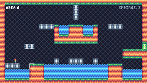

# Top Hop - A Tiny Challenge (TIC-80 Version)

This is the original version of the game.

- 8 Levels
- 240x136 Resolution

## Screenshots

|              | TIC-80 |
|--------------|:-------:|
| Title Screen |  |
| Gameplay     |  |
| Ending       |  |

## About TIC-80

Quote from the official website https://tic80.com/

```
TIC-80 is a fantasy computer for making, playing and sharing tiny games.

There are built-in tools for development: code, sprites, maps, sound editors and the command line, which is enough to create a mini retro game.
```
